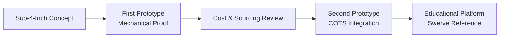

<div align="center">

# FTC Coaxial Swerve

### A compact, accessible coaxial swerve module and drivetrain for FIRST Tech Challenge

[](#the-idea)
[](https://www.firstinspires.org/robotics/ftc)
[](#at-a-glance)
[](LICENSE)

<picture>
  
</picture>

An ultra-compact coaxial swerve drivetrain platform developed to democratize omnidirectional swerve mechanics and closed-loop control in FIRST Tech Challenge robotics.

[Project Overview](#the-idea) | [Prototype Comparison](#at-a-glance) | [Test Videos](#test-videos) | [Design Evolution](#design-evolution) | [Project Page](https://angelojamesny.com/ftc-coaxial-swerve)

</div>

---

## The Idea

Swerve drivetrains provide agility and high-speed directional changes by steering all wheels independently. Unlike Mecanum wheels, swerve modules use solid rubber contact wheels to deliver full pushing force and zero slip during acceleration.

This project developed a miniaturized coaxial swerve module specifically optimized for the constraints, build patterns, and budget realities of FTC robotics teams.

| System Parameter | First Prototype | Second Prototype (Refined) |
| --- | --- | --- |
| Kinematic type | Coaxial drive and steering | Coaxial drive and steering |
| Module envelope | Under 4" × 4" × 4" (Ultra-compact) | ~4.25" height (Marketplace-optimized) |
| Form factor | L-shaped asymmetrical body | Symmetrical rectangular housing |
| Actuators per module | 1 DC motor + 1 continuous servo | 1 DC motor + 1 continuous servo |
| Mounting ecosystem | Custom bolt pattern | Multi-pattern: goBILDA, REV, & AndyMark |
| Manufacturing objective | Proof of concept and packaging | Sourcing simplification & bill of materials reduction |

> [!NOTE]
> **Project Status:** Complete. The design serves as an educational open-source reference for FTC swerve kinematics, mechanical packaging, and control software.

## Prototype Iterations

### 01 / First Prototype (Sub-4" Envelope)
Engineered for minimum physical volume, packing coaxial bevel gears, thrust bearings, and dual shafts within a 4-inch cube. While mechanically functional, heavy reliance on custom-turned shafts and complex 3D-printed housings increased production costs to ~$400 per module.

---

### 02 / Second Prototype (Marketplace Integration)
Redesigned to prioritize cost efficiency and accessibility:
- Replaced specialty custom components with standard off-the-shelf gears, bearings, and shafts.
- Re-architected the frame into a clean rectangular profile with multi-standard mounting grids (goBILDA 16mm, REV 8mm, AndyMark).
- Maintained a sub-4.25" total height while significantly lowering fabrication barriers.

<div align="center">
  
</div>

## Test Videos

Click any locally hosted preview thumbnail to watch the physical bench and driving tests on YouTube:

| First Prototype Bench Test | Second Prototype Drive Test | Second Prototype Module Test |
| :---: | :---: | :---: |
| [](https://www.youtube.com/watch?v=wlv9R7z8qWg) | [](https://www.youtube.com/watch?v=rI8ipH3kocA) | [](https://www.youtube.com/watch?v=rHLFf1NIRc8) |
| **[Watch Bench Test](https://www.youtube.com/watch?v=wlv9R7z8qWg)** | **[Watch Driving Test](https://www.youtube.com/watch?v=rI8ipH3kocA)** | **[Watch Module Test](https://www.youtube.com/watch?v=rHLFf1NIRc8)** |

## Design Evolution



## Repository Structure

```text
.
├── assets/
│   ├── images/              # Full-resolution prototype solid models and renders
│   └── video-thumbnails/    # Local preview assets for YouTube test footage
├── ATTRIBUTION.md           # Ready-to-use citation and attribution guidelines
├── LICENSE                  # Creative Commons Attribution 4.0 International
└── README.md                # System documentation
```

## License & Attribution

Original design, solid models, and documentation © 2025–2026 **Angelo Demetroulakos**. Licensed under the **[Creative Commons Attribution 4.0 International License](LICENSE)**.

---

<div align="center">

Designed and documented by **[Angelo Demetroulakos](https://angelojamesny.com)** · **[FTC Coaxial Swerve](https://angelojamesny.com/ftc-coaxial-swerve)**

</div>
