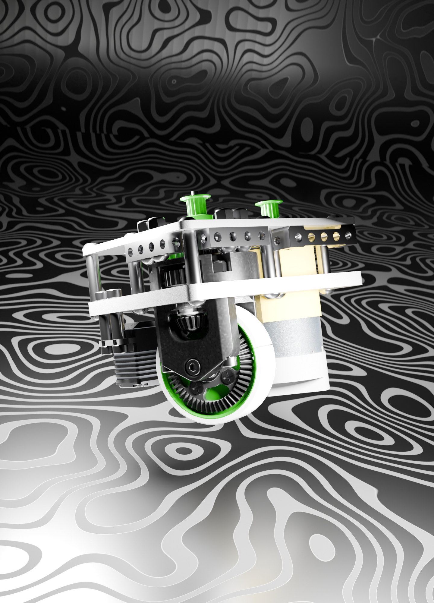
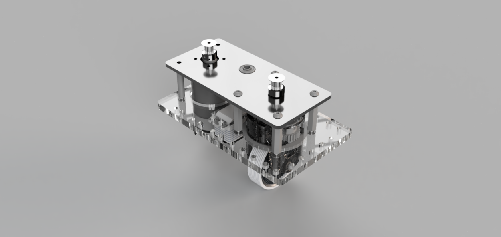
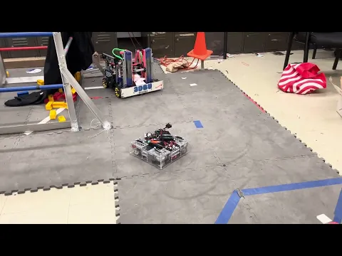
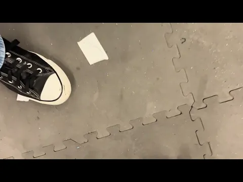
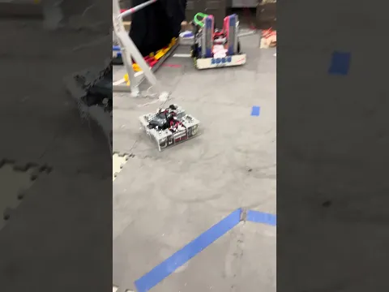
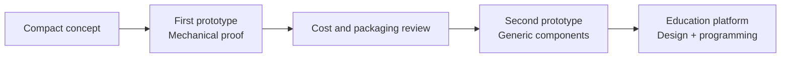

<div align="center">

# FTC Coaxial Swerve

### A compact, accessible coaxial swerve drivetrain for FIRST Tech Challenge

[](https://angelojamesny.com/ftc-coaxial-swerve)
[](LICENSE)
[](https://www.firstinspires.org/robotics/ftc)

**[Project page](https://angelojamesny.com/ftc-coaxial-swerve) · [Watch the tests](#test-videos) · [License & credit](#license--attribution)**

</div>

---

## The idea

Swerve drivetrains are exceptionally capable in robotics competitions where mobility matters and robot to robot damage is limited. They offer true omnidirectional movement without giving up wheel traction—but their mechanical and software complexity has historically kept them out of reach for many FTC students.

This project set out to change that by developing compact coaxial swerve modules that can be used to teach drivetrain design and programming, and that could eventually be produced at a price accessible to teams around the world.

> **Project status:** Finished. The drivetrain now serves as an educational platform for swerve design and programming.

## At a glance

| | First prototype | Second prototype |
|:--|:--|:--|
| **Architecture** | Coaxial module | Revised coaxial module |
| **Module envelope** | Under 4 × 4 × 4 in | Less than 0.25 in taller |
| **Shape** | L shaped | Rectangular |
| **Per module actuation** | 1 motor + 1 servo | 1 motor + 1 servo |
| **Mounting ecosystem** | Original custom layout | goBILDA, REV, and AndyMark |
| **Primary goal** | Prove mechanical viability | Reduce cost and improve integration |

## First prototype

The first prototype focused on making each pod as small as possible. At under **4 × 4 × 4 inches**, the module is among the smallest designs of its kind. A complete drivetrain was manufactured and assembled to test whether the concept was viable.

Inside each module, 3D printed structural parts support the shafts, gears, and bearings. Those shafts connect the drive motor and steering servo to the pod, giving each corner both wheel propulsion and independent steering.

The chassis proved that the mechanical design worked, though its control code still had room to improve. The larger obstacle was manufacturing cost: custom components pushed each module to approximately **$400**, placing a complete chassis near **$1,300** and making the design impractical for mass production.

<p align="center">
  
</p>

## Second prototype

The second iteration addresses the lessons learned from the original robot:

- Replaces more custom components with widely available marketplace parts.
- Reduces the total number of expensive custom made components.
- Changes the module body from an L shaped layout to a cleaner rectangle.
- Adds a versatile hole pattern compatible with **goBILDA**, **REV**, and **AndyMark** build systems.
- Accepts a height increase of less than one quarter inch in exchange for lower cost and easier sourcing.

<p align="center">
  
</p>

## Test videos

GitHub does not support embedded YouTube players inside a README. Select any preview below to watch the original test on YouTube.

<table>
  <tr>
    <td width="33%" align="center">
      <a href="https://www.youtube.com/watch?v=wlv9R7z8qWg">
        
      </a>
      <br><strong>Coaxial Swerve Test</strong>
      <br><sub>First prototype</sub>
    </td>
    <td width="33%" align="center">
      <a href="https://www.youtube.com/watch?v=rI8ipH3kocA">
        
      </a>
      <br><strong>Drive Test Swerve</strong>
      <br><sub>Second prototype drive test</sub>
    </td>
    <td width="33%" align="center">
      <a href="https://www.youtube.com/watch?v=rHLFf1NIRc8">
        
      </a>
      <br><strong>Coaxial Swerve Test 3627</strong>
      <br><sub>Second prototype module test</sub>
    </td>
  </tr>
</table>

## Design evolution



## Repository contents

```text
.
├── assets/
│   ├── images/              # Full-resolution prototype images
│   └── video-thumbnails/    # Local previews for the three test videos
├── ATTRIBUTION.md           # Ready-to-use credit instructions
├── LICENSE                  # Creative Commons Attribution 4.0 legal code
└── README.md                # Project story, prototypes, and test media
```

## License & attribution

© 2025–2026 **Angelo Demetroulakos**.

The original project text, images, and design documentation in this repository are licensed under the **[Creative Commons Attribution 4.0 International License](LICENSE)**. You may share and adapt them—including commercially—but you **must give appropriate credit**, link to the license, and indicate whether you made changes.

A copy without the required attribution is not compliant with the license. See [ATTRIBUTION.md](ATTRIBUTION.md) for a ready-to-use credit line and the exact reuse checklist.

YouTube and FIRST names, marks, and platform elements remain the property of their respective owners. Linked videos remain hosted on YouTube.

---

<div align="center">

Designed and documented by **[Angelo Demetroulakos](https://angelojamesny.com)**

[GitHub](https://github.com/TheTheAloe) · [LinkedIn](https://www.linkedin.com/in/angelo-demetroulakos) · [Printables](https://www.printables.com/@Aloe_448659)

</div>
